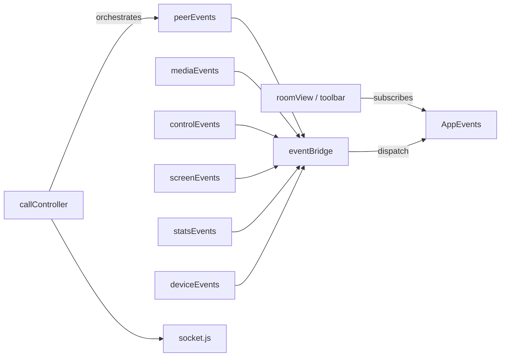

# QuickMeet — Architecture Decision Record

**Version:** 1.10.0 (Phase 10)  
**Individual ADRs:** [docs/adr/](./adr/README.md)

---

## Project Overview

### Purpose

QuickMeet is a production-ready, browser-based **1-on-1 video calling** application built entirely with **raw WebRTC**. It demonstrates how to implement real-time video communication from first principles: room management, WebSocket signaling, peer connection negotiation, media controls, screen sharing, connection health monitoring, and device management — without third-party RTC SDKs.

### Goals

| Goal | How It Is Met |
|------|---------------|
| Educational transparency | Every WebRTC step is visible in source (offer, answer, ICE, tracks) |
| Production quality | Input validation, cleanup, logging, browser checks, health monitoring |
| Zero build step | Vanilla ES modules served directly by Express |
| 1-on-1 focus | Max 2 participants per room; mesh topology (single peer connection) |
| Maintainable architecture | Layered modules with event bus decoupling |

### Problem Statement

Building a reliable browser video call requires coordinating REST APIs, real-time signaling, media permissions, peer connection state, and UI feedback. Most tutorials use high-level SDKs that hide these concerns. QuickMeet exists to provide a **complete, readable reference implementation** that engineers can study, extend, or deploy for simple 1-on-1 use cases.

### Why QuickMeet Exists

- **Students and developers** learning WebRTC internals
- **Small teams** needing instant video without accounts or downloads
- **Interview platforms** prototyping 1-on-1 sessions
- **Architects** evaluating event-driven SPA design without framework overhead

---

## Major Architectural Decisions

### Raw WebRTC Instead of Third-Party SDKs

**Why:** Full control over `RTCPeerConnection`, SDP, ICE, and `replaceTrack()`. No licensing cost or vendor lock-in. Aligns with the project's educational mission.

**Where:** `peerConnection.js`, `negotiation.js`, `iceManager.js`, `AppConfig.ICE_SERVERS`

→ [ADR 0001](./adr/0001-use-raw-webrtc.md)

### WebSocket Signaling

**Why:** WebRTC requires out-of-band SDP/ICE exchange. A persistent WebSocket on the same HTTP port handles both room events and signaling with minimal latency.

**Where:** `server/websocket/`, `client/js/socket/socket.js`

→ [ADR 0002](./adr/0002-websocket-signaling.md)

### Express Backend

**Why:** Mature, minimal HTTP framework for REST room APIs, static file serving, CORS, and JSON parsing. Single process hosts HTTP + WebSocket.

**Where:** `server/app.js`, `server/server.js`

### Vanilla JavaScript (ES Modules)

**Why:** No transpilation or bundler required. Modules load directly in modern browsers. Keeps the dependency surface to Express, `ws`, `cors`, and `dotenv`.

**Where:** All `client/js/**/*.js` use `import`/`export`

### Event Bus Architecture

**Why:** Decouple WebRTC domain logic from UI. Domain modules publish local events; `eventBridge.js` promotes them to application-level `AppEvents` that `roomView.js` and toolbar consume.

**Where:** `eventBus.js`, `appEvents.js`, `eventBridge.js`, domain `*Events.js` files

→ [ADR 0003](./adr/0003-event-bus-architecture.md)

### Application Controller

**Why:** `callController.js` is the single orchestrator for signaling, peer lifecycle, and session teardown. Prevents scattered WebRTC logic across UI files.

**Responsibilities:** Connect socket, join room, create/handle offers, manage ICE, start health monitoring, coordinate device services.

### Application State

**Why:** `appState.js` holds a read-only snapshot of active/preferred devices and permissions for UI and `mediaSwitcher` without prop-drilling.

**Scope:** Device IDs, enumerated lists, permission status, switching flag. Does **not** store peer connection or call metadata.

### Modular Folder Structure

**Why:** Predictable locations per concern; phases map to directories. Enforces mental model: config → core → webrtc → media → ui.

→ [ADR 0004](./adr/0004-modular-folder-structure.md)

### Single Responsibility Principle

Each file owns one concern:

| Module | Single Responsibility |
|--------|----------------------|
| `socket.js` | WebSocket connect/send/listen |
| `peerConnection.js` | Create/configure/close `RTCPeerConnection` |
| `negotiation.js` | SDP offer/answer only |
| `iceManager.js` | ICE candidate queue and flush |
| `healthCalculator.js` | Score computation from metrics |
| `messageHandler.js` | Validate and route WS messages |

### Event-Driven Design

UI never calls WebRTC APIs directly. Flow: user action → control module → domain event → bridge → app event → UI update.

### Media Layer

`webrtc/media/media.js` acquires `getUserMedia`, manages local `MediaStream`, dispatches `MEDIA_STARTED` / `PERMISSION_DENIED`. Video constraints: 1280×720 ideal, 30 fps.

### Socket Layer

Thin wrapper around browser `WebSocket`. Auto-responds to server `PING` with `PONG`. Clears listeners on `disconnect()`.

### Peer Layer

`RTCPeerConnection` with STUN. Caller creates offer on `USER_JOINED`; callee handles offer and sends answer. ICE trickled via `onicecandidate` → socket → remote `addIceCandidate`.

### UI Layer

`roomView.js` binds DOM reactions to `AppEvents`. `toolbarController.js` wires mute/camera/screen/end buttons. `healthIndicator.js` bridges stats to badge DOM.

### Connection Monitoring

`getStats()` polled every 2 seconds. Metrics parsed → weighted health score (0–100) → quality badge with RTT and packet loss display.

### Device Management

Enumeration, hot-plug, `replaceTrack()` switching, `localStorage` preferences, settings modal with preview.

→ [ADR 0005](./adr/0005-device-management.md)

---

## Alternatives Considered

| Alternative | Reason Not Selected |
|-------------|---------------------|
| **Firebase** | External service, auth coupling, opaque real-time layer; project targets self-hosted Node |
| **Socket.IO** | Extra protocol and client weight; native `ws` sufficient for 1-on-1 |
| **React** | Build tooling overhead for two static pages; vanilla JS matches zero-build goal |
| **Twilio** | Paid SDK hides WebRTC lifecycle; conflicts with learning objectives |
| **Agora** | Optimized for large-scale RTC; unnecessary for 2-party mesh |
| **LiveKit** | SFU architecture designed for multi-party; overkill for 1-on-1 |
| **Daily** | Hosted rooms and SDK abstraction; not aligned with from-scratch implementation |

---

## Trade-offs

### Advantages

- **Transparency:** Every signaling and media step is traceable in source
- **Low operational cost:** Single Node process, in-memory rooms, no external RTC billing
- **Fast iteration:** No build step; refresh browser to test client changes
- **Clean boundaries:** Event bus prevents UI/WebRTC entanglement
- **Device switching without renegotiation:** `replaceTrack()` keeps calls stable

### Disadvantages

- **STUN only:** No TURN server; restrictive NATs may fail to connect
- **No persistence:** Rooms evaporate on server restart; no user accounts
- **1-on-1 only:** `MAX_PARTICIPANTS = 2` hard-coded
- **Manual reconnect:** Socket disconnect ends the call; no auto-rejoin
- **Convention-based layering:** No compile-time enforcement of module boundaries

### Scalability

| Dimension | Current Capacity | Bottleneck |
|-----------|------------------|------------|
| Rooms | In-memory, single process | RAM; no horizontal scaling |
| Participants | 2 per room | By design |
| Signaling | O(1) forward per message | Single Node event loop |
| Media | Peer-to-peer (no server relay) | Client bandwidth/NAT |

Scaling beyond single-server 1-on-1 requires Redis room store, TURN infrastructure, and multi-party SFU — all **future work**.

### Maintainability

Modular ES modules and ADRs aid onboarding. Event bus adds indirection but centralizes UI reactions. Phase-based changelog documents evolution.

### Performance

- P2P media avoids server transcoding
- Stats polling at 2s interval balances accuracy vs CPU
- Track cleanup on disconnect prevents memory leaks (Phase 10)
- `replaceTrack()` avoids renegotiation latency

### Complexity

Higher than SDK-based apps due to manual ICE, signaling, and event wiring. Lower than multi-party SFU systems.

---

## Lessons Learned

### Architecture Improvements

1. **Introduce `callController` early** — deferring orchestration leads to UI files owning WebRTC logic
2. **Bridge pattern scales** — adding Phase 8 stats and Phase 9 devices required only new bridge mappings, not UI rewrites
3. **Centralize config** — `appConfig.js` and `server/config/constants.js` eliminated magic numbers across phases
4. **Validate at boundaries** — WebSocket payload validation (Phase 10) catches malformed clients before they reach room logic

### Design Patterns

| Pattern | Usage |
|---------|-------|
| Observer / Pub-Sub | `eventBus.js`, domain `*Events.js` |
| Controller | `callController.js` |
| Service Layer | `roomService.js`, `mediaSwitcher.js` |
| Module Pattern | ES modules with explicit exports |
| Factory | `createPeerConnection()`, `createEventBus()` |

### Future Extensibility

| Extension | Integration Point |
|-----------|-------------------|
| TURN servers | `AppConfig.ICE_SERVERS` |
| Authentication | Express middleware + WS handshake token |
| Reconnection | Subscribe to `SOCKET_DISCONNECTED` in controller |
| Recording | Hook `CALL_STARTED` / `CALL_ENDED` |
| Multi-party | New signaling topology + SFU or full mesh |
| Adaptive bitrate | `RTCRtpSender.setParameters()` after device switch |

---

## Decision Index

| # | Decision | Document |
|---|----------|----------|
| 0001 | Raw WebRTC | [0001-use-raw-webrtc.md](./adr/0001-use-raw-webrtc.md) |
| 0002 | WebSocket signaling | [0002-websocket-signaling.md](./adr/0002-websocket-signaling.md) |
| 0003 | Event bus architecture | [0003-event-bus-architecture.md](./adr/0003-event-bus-architecture.md) |
| 0004 | Modular folder structure | [0004-modular-folder-structure.md](./adr/0004-modular-folder-structure.md) |
| 0005 | Device management | [0005-device-management.md](./adr/0005-device-management.md) |
