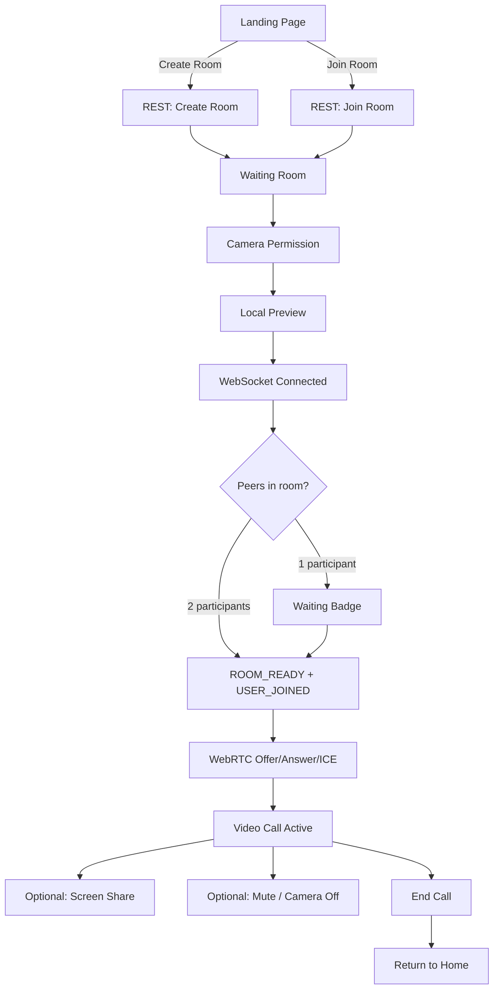

# QuickMeet — Product Documentation

**Version:** 1.10.0  
**Status:** Production-ready (Phase 10 complete)

---

## Product Vision

QuickMeet enables **instant, account-free 1-on-1 video calls** in the browser. Users create or join a room with a short code (`ABC-123`), grant camera/microphone access, and connect peer-to-peer — no downloads, no sign-up, no plugins.

The product prioritizes **simplicity and speed**: one click to create a room, one code to share, automatic call setup when the second participant arrives.

---

## Product Goals

| Goal | Metric / Outcome |
|------|------------------|
| Zero friction onboarding | No registration; room code is the only credential |
| Sub-minute time-to-call | Create room → share code → auto-connect when peer joins |
| Reliable 1-on-1 experience | Mute, camera toggle, screen share, connection health visibility |
| Device flexibility | Switch camera/microphone mid-call; preferences remembered |
| Transparent quality | Real-time network health badge (0–100 score) |
| Self-hostable | Single Node.js deployment; MIT license |

---

## Target Users

### Students

Learn how production WebRTC applications are structured. QuickMeet's readable codebase maps directly to WebRTC concepts (SDP, ICE, tracks).

### Developers

Reference implementation for signaling, `replaceTrack()`, stats monitoring, and event-driven SPA architecture without React or SDKs.

### Remote Teams

Quick ad-hoc 1-on-1 check-ins when a full meeting platform is unnecessary. Share a room code via chat.

### Interview Platforms

Prototype technical interviews or pair sessions. Two-tab testing works out of the box on localhost.

### Small Businesses

Lightweight customer calls or internal 1-on-1s. Self-host behind HTTPS for basic privacy control.

---

## Core Features

| Feature | Description | Status |
|---------|-------------|--------|
| **Room Creation** | `POST /api/rooms/create` → unique `ABC-123` code | ✅ Implemented |
| **Room Joining** | Enter code on home page or direct URL `room.html?room=ABC-123` | ✅ Implemented |
| **Video Calling** | P2P video via `RTCPeerConnection` | ✅ Implemented |
| **Audio Calling** | Microphone track in same peer connection | ✅ Implemented |
| **Screen Sharing** | `getDisplayMedia()` + `replaceTrack()` | ✅ Implemented |
| **Mute** | Toggle audio track `enabled` | ✅ Implemented |
| **Camera Toggle** | Toggle video track `enabled` | ✅ Implemented |
| **Connection Health** | `getStats()` polling, 0–100 score, RTT/loss display | ✅ Implemented |
| **Device Switching** | Camera/mic enumeration and hot-swap | ✅ Implemented |
| **Responsive UI** | Mobile-friendly layout, Inter font, accessible controls | ✅ Implemented |

---

## User Journey

### Step-by-Step

1. **Landing Page** (`index.html`) — User sees Create Room and Join Room options
2. **Create Room** — Server generates code; browser navigates to waiting room
3. **Waiting Room** (`room.html`) — Local camera preview starts; status shows "Waiting"
4. **Peer Joins** — Second user joins via code; both receive `ROOM_READY` and `USER_JOINED`
5. **Video Call** — Caller sends SDP offer; callee answers; ICE connects; remote video appears
6. **Screen Share** — User clicks share button; display track replaces outbound video
7. **End Call** — User clicks end; session tears down; redirect to home

---

## Functional Requirements

### Room Management

| ID | Requirement | Implementation |
|----|-------------|----------------|
| FR-01 | User can create a room | `POST /api/rooms/create` |
| FR-02 | Room code format `ABC-123` | `ROOM_CODE_PATTERN` server + client |
| FR-03 | User can join by code | `POST /api/rooms/join` + home page input |
| FR-04 | Max 2 participants per room | `ROOM_LIMITS.MAX_PARTICIPANTS = 2` |
| FR-05 | Room full returns error | HTTP 403 / WS `ROOM_FULL` |
| FR-06 | Copy room code to clipboard | Copy button on waiting room |
| FR-07 | Invalid/missing room code redirects home | `room.js` validation |

### Media

| ID | Requirement | Implementation |
|----|-------------|----------------|
| FR-10 | Request camera + microphone | `getUserMedia` in `media.js` |
| FR-11 | Local video preview | `#localVideo` / `#video-preview` |
| FR-12 | Handle permission denied | `MEDIA_PERMISSION_DENIED` → UI placeholder |
| FR-13 | Default 720p @ 30fps | `AppConfig.VIDEO` constraints |

### WebRTC

| ID | Requirement | Implementation |
|----|-------------|----------------|
| FR-20 | Automatic call when 2nd peer joins | `callController.startAsCaller()` |
| FR-21 | SDP offer/answer exchange | `negotiation.js` + WebSocket |
| FR-22 | ICE candidate trickling | `iceManager.js` |
| FR-23 | Remote video display | `#remoteVideo` via `ontrack` |
| FR-24 | STUN for NAT traversal | `stun.l.google.com:19302` |

### Controls

| ID | Requirement | Implementation |
|----|-------------|----------------|
| FR-30 | Mute/unmute microphone | `audioControl.js` |
| FR-31 | Enable/disable camera | `videoControl.js` |
| FR-32 | End call and cleanup | `callManager.js` → `destroySession()` |
| FR-33 | Screen share toggle | `screenManager.js` |
| FR-34 | Toolbar disabled until media ready | `toolbarController.setMediaControlsEnabled()` |
| FR-35 | Screen share enabled only when connected | `setScreenShareEnabled(true)` on `CALL_STARTED` |

### Monitoring

| ID | Requirement | Implementation |
|----|-------------|----------------|
| FR-40 | Poll connection statistics | `statsCollector.js` every 2s |
| FR-41 | Display health score 0–100 | `healthCalculator.js` |
| FR-42 | Show RTT and packet loss | `qualityBadge.js` |
| FR-43 | Health levels: Excellent → Critical | Thresholds in `AppConfig.HEALTH_THRESHOLDS` |

### Device Management

| ID | Requirement | Implementation |
|----|-------------|----------------|
| FR-50 | List available cameras/mics | `enumerateDevices()` |
| FR-51 | Switch camera mid-call | `mediaSwitcher.switchCamera()` |
| FR-52 | Switch microphone mid-call | `mediaSwitcher.switchMicrophone()` |
| FR-53 | Persist preferred devices | `localStorage` via `devicePersistence.js` |
| FR-54 | Hot-plug fallback | `handleDeviceRemoved()` |
| FR-55 | Settings modal with preview | `settingsModal.js` |
| FR-56 | Device menu quick access | `deviceMenu.js` |

### Signaling

| ID | Requirement | Implementation |
|----|-------------|----------------|
| FR-60 | WebSocket room join | `JOIN_ROOM` message |
| FR-61 | Waiting state for solo participant | `ROOM_WAITING` |
| FR-62 | Notify peer departure | `USER_LEFT` |
| FR-63 | Heartbeat keepalive | `PING`/`PONG` every 30s |

---

## Non-Functional Requirements

### Performance

| Requirement | Implementation |
|-------------|----------------|
| P2P media (no server relay) | Direct `RTCPeerConnection` between browsers |
| Stats polling ≤ 2s interval | `STATS_POLL_INTERVAL_MS: 2000` |
| Device switch without renegotiation | `replaceTrack()` |
| Production logging quiet by default | Client `LOG_LEVEL: warn` off localhost |

### Security

| Requirement | Implementation |
|-------------|----------------|
| Room code validation | Regex `^[A-Z]{3}-\d{3}$` |
| WebSocket message size limit | 64 KB max |
| SDP length limit | 32 KB max |
| Payload type validation | Plain object check |
| XSS prevention | `textContent` for notifications; escaped device labels |
| HTTPS for media | Required except `localhost` |

### Reliability

| Requirement | Implementation |
|-------------|----------------|
| Heartbeat detects dead sockets | 30s interval, terminate on timeout |
| Peer disconnect cleanup | `cleanupPeerConnection()` |
| Page unload cleanup | `beforeunload` handler in `room.js` |
| Global error handler (server) | Express error middleware |

### Scalability

| Requirement | Current State |
|-------------|---------------|
| Horizontal scaling | **Not supported** — in-memory rooms |
| Multi-party | **Not supported** — 2 participants max |
| TURN relay | **Not configured** — STUN only |

### Accessibility

| Requirement | Implementation |
|-------------|----------------|
| ARIA labels on controls | Toolbar buttons, health badge `role="status"` |
| Keyboard support | Enter to join room; device menu shortcuts |
| Live regions | `aria-live="polite"` on loading and health badge |
| Semantic HTML | `<main>`, `<section>`, labeled inputs |

### Responsiveness

| Requirement | Implementation |
|-------------|---------------|
| Mobile viewport | `meta viewport` + responsive CSS |
| Touch-friendly toolbar | Large tap targets in `room.css` |
| Video `playsinline` | iOS compatibility |

---

## User Interface Overview

### Home Page (`index.html`)

- Logo, title, tagline
- **Create Room** primary button
- **Join Room** with code input (`ABC-123` format, auto-uppercase)
- Browser compatibility check disables buttons if WebRTC unsupported

### Waiting Room (`room.html`)

- **Video preview area** — local camera, loading spinner, error placeholder
- **Remote video** — appears when peer stream ready (hidden until connected)
- **Room code display** with copy button
- **Status text** — waiting, connecting, connected
- **Waiting badge** — visual state (Waiting / Ready)
- **Notification toasts** — join/leave/errors

### Call Screen

When `CALL_STARTED` fires, the UI transitions:

- Remote video visible (picture-in-picture local preview)
- Toolbar fully enabled
- Health badge visible
- Status: "Connected — video call active"

### Toolbar

| Control | Action |
|---------|--------|
| Mute | Toggle `audioTrack.enabled` |
| Camera | Toggle `videoTrack.enabled` |
| Screen Share | Start/stop display capture |
| Settings | Open device settings modal |
| End Call | Teardown session, redirect home |

### Settings

- Camera dropdown with live preview
- Microphone dropdown
- Apply saves preferences to `localStorage`
- Preview tracks stopped on modal destroy

### Health Badge

- Collapsed: emoji + label (Excellent/Good/Fair/Poor/Critical)
- Metrics: RTT (ms), packet loss (%)
- Expandable details panel
- Hidden when not monitoring a peer connection

---

## Browser Support

| Browser | Support Level | Notes |
|---------|---------------|-------|
| **Chrome** | Full | Primary development target |
| **Edge** | Full | Chromium-based; identical behavior |
| **Firefox** | Full | Tested with `replaceTrack` and screen share |
| **Safari 11+** | Supported | Test device switching and `getDisplayMedia` separately |

**Requirements:**

- `RTCPeerConnection` and `navigator.mediaDevices.getUserMedia`
- **HTTPS** or `localhost` for media access
- `getDisplayMedia` for screen sharing (checked via `supportsDisplayMedia()`)

---

## Known Limitations

| Limitation | Impact |
|------------|--------|
| **1-on-1 only** | Third participant receives "Room Full" |
| **HTTPS required** | `getUserMedia` blocked on insecure origins (except localhost) |
| **No recording** | No `MediaRecorder` or server-side capture |
| **No chat** | Signaling carries WebRTC only; no text channel |
| **No authentication** | Anyone with room code can join |
| **No TURN server** | Symmetric NAT / strict firewalls may block connection |
| **No reconnection** | Socket or peer disconnect ends the call |
| **In-memory rooms** | Server restart clears all rooms |
| **No mobile app** | Browser-only; no native iOS/Android clients |

---

## REST API Summary

| Method | Endpoint | Description |
|--------|----------|-------------|
| `POST` | `/api/rooms/create` | Create room → `{ roomCode }` |
| `POST` | `/api/rooms/join` | Join room `{ roomCode }` |
| `POST` | `/api/rooms/leave` | Leave room |
| `GET` | `/api/rooms/:code` | Room status |
| `GET` | `/health` | Server health check |

---

## Environment Configuration

| Variable | Default | Purpose |
|----------|---------|---------|
| `PORT` | `3000` | HTTP + WebSocket port |
| `NODE_ENV` | `development` | Production reduces logging |
| `LOG_LEVEL` | `debug` / `warn` | Server log verbosity |

Client debug logging: enabled on `localhost` or `?debug=true` in URL.
