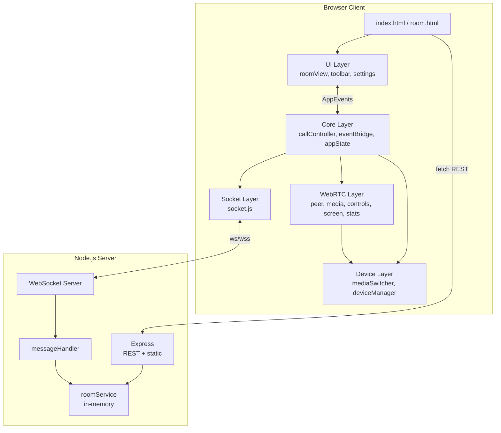
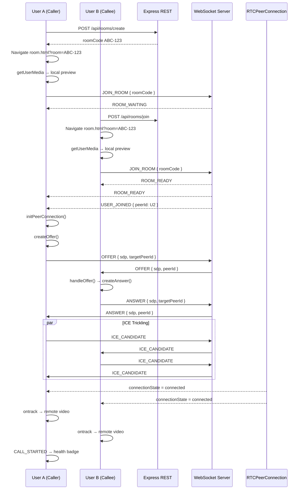
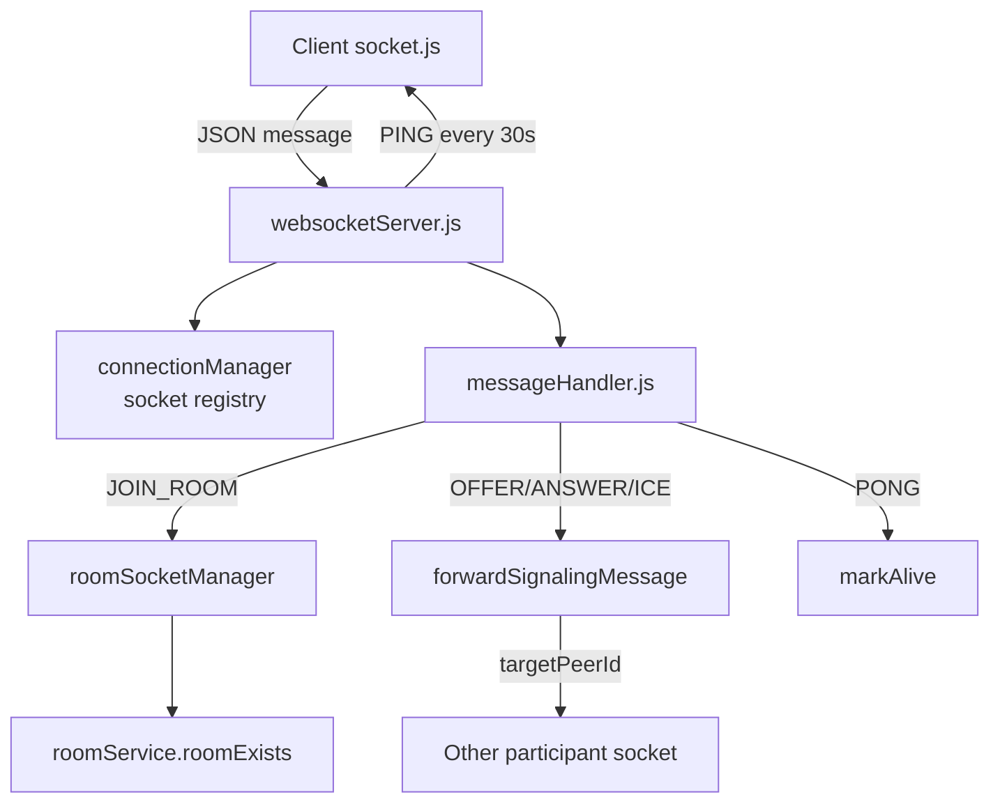
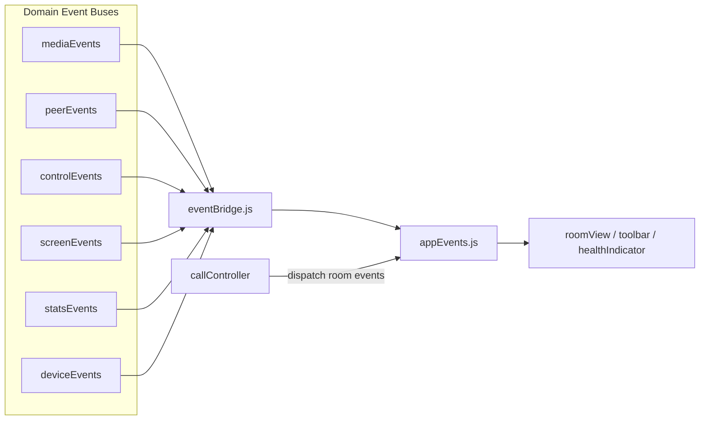

# QuickMeet — Technical Documentation

**Version:** 1.10.0  
**Node:** ≥ 18.0.0

---

## Technology Stack

### Frontend

| Technology | Role |
|------------|------|
| **HTML5** | `index.html` (home), `room.html` (call) |
| **CSS3** | `components.css`, `home.css`, `room.css` |
| **Vanilla JavaScript (ES Modules)** | 49 modules under `client/js/` |
| **Google Fonts (Inter)** | Typography |
| **localStorage** | Preferred camera/microphone persistence |

No bundler, transpiler, or frontend framework.

### Backend

| Technology | Version | Role |
|------------|---------|------|
| **Node.js** | ≥ 18 | Runtime |
| **Express** | ^4.21 | HTTP server, REST API, static files |
| **ws** | ^8.18 | WebSocket signaling |
| **cors** | ^2.8.5 | Cross-origin requests |
| **dotenv** | ^16.4 | Environment variables |

### Browser APIs

| API | Usage |
|-----|-------|
| `RTCPeerConnection` | P2P media connection |
| `navigator.mediaDevices.getUserMedia` | Camera + microphone |
| `navigator.mediaDevices.getDisplayMedia` | Screen sharing |
| `navigator.mediaDevices.enumerateDevices` | Device lists |
| `RTCPeerConnection.getStats()` | Connection monitoring |
| `RTCRtpSender.replaceTrack()` | Screen share + device switching |
| `WebSocket` | Signaling transport |
| `navigator.clipboard` | Copy room code |
| `navigator.permissions.query` | Permission state (when supported) |

---

## Complete Folder Structure

```
quickmeet/
├── client/                          # Static SPA served by Express
│   ├── index.html                   # Home — create/join room
│   ├── room.html                    # Waiting room + call UI
│   ├── css/
│   │   ├── components.css           # Shared buttons, cards, badges
│   │   ├── home.css                 # Landing page layout
│   │   └── room.css                 # Video area, toolbar, health badge
│   └── js/
│       ├── config/
│       │   └── appConfig.js         # ICE, thresholds, socket events, video constraints
│       ├── core/
│       │   ├── appEvents.js         # Application event constants + bus
│       │   ├── appState.js          # Device/session state snapshot
│       │   ├── callController.js    # Signaling + peer lifecycle orchestrator
│       │   ├── eventBridge.js       # Domain → app event mapping
│       │   ├── eventBus.js          # Generic pub/sub factory
│       │   └── roomView.js          # UI reactions to AppEvents
│       ├── media/                   # Phase 9 device management
│       │   ├── cameraManager.js     # Acquire camera track by deviceId
│       │   ├── deviceEvents.js      # Device domain event bus
│       │   ├── deviceManager.js     # Enumeration, hot-plug, lists
│       │   ├── devicePersistence.js # localStorage read/write
│       │   ├── mediaSwitcher.js     # replaceTrack() orchestration
│       │   ├── microphoneManager.js # Acquire mic track by deviceId
│       │   └── permissionWatcher.js # Permission state changes
│       ├── socket/
│       │   └── socket.js            # WebSocket client wrapper
│       ├── ui/
│       │   ├── deviceMenu.js        # Quick device access menu
│       │   ├── healthIndicator.js   # Stats → badge bridge
│       │   └── settingsModal.js     # Camera/mic settings + preview
│       ├── utils/
│       │   ├── browserSupport.js    # WebRTC capability checks
│       │   └── logger.js            # Configurable client logging
│       ├── webrtc/
│       │   ├── controls/
│       │   │   ├── audioControl.js      # Mute/unmute logic
│       │   │   ├── callManager.js       # End call lifecycle
│       │   │   ├── controlEvents.js     # Control domain bus
│       │   │   ├── toolbarController.js # Toolbar DOM bindings
│       │   │   └── videoControl.js      # Camera on/off logic
│       │   ├── media/
│       │   │   ├── deviceManager.js     # Initial enumeration (Phase 4)
│       │   │   ├── media.js             # Local MediaStream manager
│       │   │   ├── mediaEvents.js       # Media domain bus
│       │   │   └── permissions.js       # getUserMedia + error messages
│       │   ├── peer/
│       │   │   ├── iceManager.js        # ICE candidate queue/flush
│       │   │   ├── negotiation.js       # SDP offer/answer
│       │   │   ├── peerConnection.js    # RTCPeerConnection factory
│       │   │   ├── peerEvents.js        # Peer domain bus
│       │   │   └── remoteStream.js      # ontrack → video element
│       │   ├── screen/
│       │   │   ├── screenEvents.js      # Screen share domain bus
│       │   │   ├── screenManager.js     # Share start/stop coordinator
│       │   │   ├── screenShare.js       # getDisplayMedia wrapper
│       │   │   ├── screenState.js       # Screen share state
│       │   │   └── trackReplacement.js  # replaceVideoTrack helper
│       │   └── stats/
│       │       ├── connectionMonitor.js # Stats orchestrator
│       │       ├── healthCalculator.js  # 0–100 score computation
│       │       ├── networkMonitor.js    # Anomaly detection
│       │       ├── performanceLogger.js # Dev-only perf logs
│       │       ├── qualityBadge.js      # Badge DOM updates
│       │       ├── statsCollector.js    # getStats() polling
│       │       ├── statsEvents.js       # Stats domain bus
│       │       └── statsParser.js       # RTCStatsReport parsing
│       ├── home.js                  # Home page entry
│       └── room.js                  # Room page entry + bootstrap
├── server/
│   ├── app.js                       # Express app configuration
│   ├── server.js                    # HTTP server + WebSocket init
│   ├── config/
│   │   └── constants.js             # Room limits, WS limits, messages
│   ├── controllers/
│   │   └── roomController.js        # REST handler functions
│   ├── routes/
│   │   └── roomRoutes.js            # /api/rooms/* routes
│   ├── services/
│   │   └── roomService.js           # In-memory room business logic
│   ├── utils/
│   │   ├── logger.js                # Configurable server logging
│   │   └── roomGenerator.js         # Unique ABC-123 code generation
│   └── websocket/
│       ├── connectionManager.js     # Socket registry + heartbeat state
│       ├── eventTypes.js            # WS event constants + error messages
│       ├── messageHandler.js        # Validate, route, forward messages
│       ├── roomSocketManager.js     # Room ↔ socketId mapping
│       └── websocketServer.js       # ws server on HTTP server
├── docs/                            # Engineering documentation
├── package.json
├── .env.example
├── ARCHITECTURE.md                  # Legacy architecture summary
├── CHANGELOG.md
├── DEPLOYMENT.md
└── QA_CHECKLIST.md
```

### Key File Responsibilities

| File | Responsibility |
|------|----------------|
| `home.js` | REST create/join → navigate to `room.html?room=CODE` |
| `room.js` | Bootstrap bridge, controller, UI, media, signaling |
| `callController.js` | **Single owner** of peer connection + signaling flow |
| `roomView.js` | DOM updates only; no WebRTC imports for actions |
| `messageHandler.js` | Server-side WS validation and signaling forward |
| `roomService.js` | In-memory room CRUD (REST layer) |
| `roomSocketManager.js` | Maps room codes to connected socket IDs |

---

## Application Architecture



### Frontend

Two-page SPA. `room.js` is the composition root:

1. `startBridge()` — wire domain → app events
2. `roomView.bind()` + `registerHandlers()` — UI subscriptions
3. `callController.init()` — session dependencies
4. `initializeMedia()` → `connectSignaling()` — parallel bootstrap

### Backend

Single Node process. `server.js` creates HTTP server, attaches WebSocket, listens on `PORT`.

### Communication

| Channel | Protocol | Purpose |
|---------|----------|---------|
| Room CRUD | HTTP REST JSON | Create/join before WebSocket |
| Signaling | WebSocket JSON `{ type, payload }` | Room events + WebRTC |
| Media | WebRTC (UDP/TCP) | P2P audio/video — not through server |

### State Management

| State | Location | Scope |
|-------|----------|-------|
| Device preferences | `appState.js` + `localStorage` | Client session |
| Call negotiating flag | `callController.js` module scope | Client session |
| Screen share state | `screenState.js` | Client session |
| Room participants | `roomService.js` in-memory object | Server |
| Socket ↔ room mapping | `roomSocketManager.js` | Server |

No Redux, no global window state. Event bus drives UI updates.

---

## Module Breakdown

### Media Module (`webrtc/media/`)

| File | Exports / Role |
|------|----------------|
| `permissions.js` | `requestMediaStream()`, default constraints, error messages |
| `media.js` | `initializeMedia()`, `getLocalStream()`, track enable/disable, cleanup |
| `mediaEvents.js` | `MEDIA_STARTED`, `PERMISSION_DENIED`, `DEVICE_CHANGED` |
| `deviceManager.js` | Initial `enumerateDevices()` for Phase 4 media setup |

### Peer Module (`webrtc/peer/`)

| File | Role |
|------|------|
| `peerConnection.js` | `createPeerConnection()`, `addLocalTracks()`, `closePeerConnection()` |
| `negotiation.js` | `createOffer()`, `handleOffer()`, `handleAnswer()`, SDP serialization |
| `iceManager.js` | Queue remote candidates until remote description set; `flushPendingCandidates()` |
| `remoteStream.js` | `setupRemoteTrackHandler()`, attach to `#remoteVideo` |
| `peerEvents.js` | `PEER_CONNECTED`, `NEGOTIATION_STARTED`, `REMOTE_STREAM_READY`, etc. |

### Socket Module

`socket.js` — connect, send, on/off, disconnect. Responds to `PING` with `PONG`. Emits `disconnected` on close. Clears listener map on disconnect (Phase 10 fix).

### Controls Module (`webrtc/controls/`)

| File | Role |
|------|------|
| `audioControl.js` | Toggle mic track enabled |
| `videoControl.js` | Toggle camera track enabled |
| `callManager.js` | End call button, `setCallActive()`, peer disconnect notification |
| `toolbarController.js` | Bind toolbar DOM, enable/disable controls |
| `controlEvents.js` | `AUDIO_MUTED`, `CALL_ENDED`, etc. |

### Screen Sharing Module (`webrtc/screen/`)

| File | Role |
|------|------|
| `screenShare.js` | `requestScreenStream()` via `getDisplayMedia` |
| `trackReplacement.js` | `replaceVideoTrack(pc, track)` on video sender |
| `screenState.js` | Stores camera track while screen active |
| `screenManager.js` | Start/stop flow, browser "Stop sharing" listener |
| `screenEvents.js` | `SCREEN_SHARE_STARTED`, `SCREEN_SHARE_STOPPED`, `SCREEN_SHARE_FAILED` |

### Statistics Module (`webrtc/stats/`)

| File | Role |
|------|------|
| `statsCollector.js` | Poll `getStats()` every 2000ms |
| `statsParser.js` | Extract RTT, jitter, packet loss, bitrate, FPS from report |
| `healthCalculator.js` | Weighted 0–100 score |
| `networkMonitor.js` | Spike detection, dispatch `NETWORK_RECOVERED` |
| `connectionMonitor.js` | Orchestrate collect → parse → health → badge |
| `qualityBadge.js` | Update `#health-badge` DOM |
| `healthIndicator.js` | Public API used by `callController` |

### Device Module (`media/`)

| File | Role |
|------|------|
| `deviceManager.js` | `start()`, `enumerateDevices()`, `devicechange` listener |
| `cameraManager.js` | `acquireCameraTrack(deviceId)` |
| `microphoneManager.js` | `acquireMicrophoneTrack(deviceId)` |
| `mediaSwitcher.js` | `switchCamera()`, `switchMicrophone()`, `applyPreferredDevices()` |
| `devicePersistence.js` | Read/write `quickmeet.preferredDevices` |
| `permissionWatcher.js` | Watch camera/mic permission changes |

### Application Module (`core/`)

| File | Role |
|------|------|
| `callController.js` | Session orchestrator |
| `eventBridge.js` | 20+ domain → app event mappings |
| `appEvents.js` | 30+ application event constants |
| `appState.js` | Device state snapshot |
| `roomView.js` | UI event handlers |

### Utilities

| File | Role |
|------|------|
| `logger.js` (client) | `debug`/`warn`/`error` based on `AppConfig.LOG_LEVEL` |
| `logger.js` (server) | `LOG_LEVEL` env-based logging |
| `browserSupport.js` | `checkWebRTCSupport()`, `supportsReplaceTrack()`, `supportsDisplayMedia()` |

---

## Complete WebRTC Flow



### Step Reference

| Step | Trigger | Code Path |
|------|---------|-----------|
| Landing Page | User opens `/` | `index.html` + `home.js` |
| Room Creation | Create button | `POST /api/rooms/create` |
| Join Room | Join button / URL param | `POST /api/rooms/join` or direct URL |
| Camera Permission | `initializeMedia()` | `permissions.requestMediaStream()` |
| Media Ready | Stream acquired | `MediaEvents.MEDIA_STARTED` → `MEDIA_READY` |
| Socket Connected | `connectSignaling()` | `socket.connect()` → `JOIN_ROOM` |
| Room Ready | 2 sockets in room | `handleJoinRoom` participantCount === 2 |
| Offer | `USER_JOINED` on caller | `callController.startAsCaller()` |
| Answer | `OFFER` on callee | `handleIncomingOffer()` |
| ICE | `onicecandidate` | `iceManager` + socket forward |
| Peer Connected | `connectionState === 'connected'` | `PEER_CONNECTED` → `CALL_STARTED` |
| Video Streaming | `ontrack` | `remoteStream.attachRemoteStream()` |

### Caller vs Callee

- **Caller:** First to receive `USER_JOINED` (existing participant when second joins)
- **Callee:** Receives `OFFER`, creates answer
- Role determined by join order, not explicit assignment

---

## WebSocket Flow



### Message Routing

1. Client sends `{ type, payload }`
2. Server parses JSON, validates size and payload shape
3. Handler lookup in `eventHandlers` map
4. **JOIN_ROOM:** validate code, check capacity, add to room map, emit waiting/ready events
5. **OFFER/ANSWER/ICE:** validate SDP/candidate, attach `peerId: socketId`, forward to `targetPeerId` or broadcast excluding sender
6. **Disconnect:** remove from room, broadcast `USER_LEFT` if peer remains

### Server Event Constants

```javascript
// server/websocket/eventTypes.js
JOIN_ROOM, ROOM_WAITING, ROOM_READY, USER_JOINED, USER_LEFT,
OFFER, ANSWER, ICE_CANDIDATE, PING, PONG, ERROR
```

---

## Event Bus Flow



### Application Events (selected)

| Category | Events |
|----------|--------|
| Lifecycle | `CALL_STARTED`, `CALL_ENDING`, `CALL_ENDED` |
| Media | `MEDIA_READY`, `MEDIA_PERMISSION_DENIED` |
| Peer | `PEER_CONNECTED`, `PEER_DISCONNECTED`, `REMOTE_STREAM_READY` |
| Controls | `AUDIO_MUTED`, `VIDEO_DISABLED` |
| Screen | `SCREEN_SHARE_STARTED`, `SCREEN_SHARE_STOPPED` |
| Network | `NETWORK_QUALITY_CHANGED`, `NETWORK_RECOVERED` |
| Room | `ROOM_WAITING`, `ROOM_READY`, `USER_JOINED`, `USER_LEFT` |
| Devices | `CAMERA_CHANGED`, `MIC_CHANGED`, `DEVICES_UPDATED` |

### Bridge Mapping Example

```javascript
// peerEvents.PEER_CONNECTED →
callManager.setCallActive(true);
dispatchApp(AppEvents.PEER_CONNECTED, detail);
dispatchApp(AppEvents.CALL_STARTED, detail);
```

`callController` dispatches room-level events (`ROOM_WAITING`, `USER_JOINED`) directly to `AppEvents` without a domain bus.

---

## Connection Monitoring

### getStats() Polling

`statsCollector.js` calls `pc.getStats()` immediately and every **2000ms** (`STATS_POLL_INTERVAL_MS`). Stops when connection closes.

### Health Calculation

`healthCalculator.js` computes weighted score:

| Metric | Weight | Source |
|--------|--------|--------|
| Packet loss | 35% | Inbound RTP stats |
| RTT | 25% | Candidate pair |
| Jitter | 20% | Inbound RTP |
| Bitrate | 10% | `availableOutgoingBitrate` |
| FPS | 10% | Outbound video |

Thresholds (`AppConfig.HEALTH_THRESHOLDS`):

| Score | Level |
|-------|-------|
| ≥ 90 | Excellent |
| ≥ 75 | Good |
| ≥ 50 | Fair |
| ≥ 25 | Poor |
| < 25 | Critical |
| disconnected | 0 |

### Quality Badge

`qualityBadge.js` updates:

- `#health-badge-dot` — emoji indicator
- `#health-badge-label` — level name
- `#health-badge-latency` — RTT in ms
- `#health-badge-loss` — packet loss %

Started in `callController.initPeerConnection()` via `healthIndicator.start(pc)`.

### Network Anomaly Detection

`networkMonitor.js` detects packet loss spikes and bitrate drops (`AppConfig.NETWORK` thresholds), dispatching `NETWORK_RECOVERED` when metrics stabilize.

---

## Device Management

### Camera Enumeration

```javascript
// deviceManager.start()
navigator.mediaDevices.enumerateDevices()
// Filters videoinput, audioinput, audiooutput
// Listens for 'devicechange' event
```

Device labels require prior `getUserMedia` permission.

### Track Replacement

```javascript
// mediaSwitcher.switchCamera(deviceId)
const newTrack = await acquireCameraTrack(deviceId);
replaceTrackInLocalStream('video', newTrack);
await replaceVideoTrack(peerConnection, newTrack);  // unless screen sharing
dispatch(DeviceEvents.CAMERA_CHANGED, { deviceId });
```

Audio switching uses `RTCRtpSender.replaceTrack()` on the audio sender.

### Permission Handling

| Scenario | Behavior |
|----------|----------|
| Initial deny | `PERMISSION_DENIED` → placeholder UI |
| Permission revoked mid-session | `permissionWatcher` → `PERMISSION_CHANGED` |
| Device unplugged | `handleDeviceRemoved()` → fallback to default |

### Persistence

```json
// localStorage key: quickmeet.preferredDevices
{ "camera": "deviceId", "microphone": "deviceId" }
```

Applied silently on media start via `applyPreferredDevices()`.

---

## Security

### Input Validation

| Layer | Validation |
|-------|------------|
| REST | Room code regex in controller |
| WebSocket | JSON parse, message size ≤ 64 KB |
| WebSocket payload | Must be plain object (not array) |
| SDP | `type` + `sdp` required; length ≤ 32 KB |
| ICE | `candidate` field required |
| Client home | Room code format before join |
| Client room | Redirect if invalid `?room=` param |

### Room Validation

- `roomService.roomExists()` before WS join
- `ROOM_LIMITS.MAX_PARTICIPANTS = 2`
- Normalized to uppercase `ABC-123`

### Payload Validation

```javascript
function isValidPayload(payload) {
  return payload !== null && typeof payload === 'object' && !Array.isArray(payload);
}
```

### Cleanup

| Resource | Cleanup Trigger |
|----------|-----------------|
| MediaStream tracks | `media.cleanup()`, `destroySession()` |
| RTCPeerConnection | `closePeerConnection()` — nullifies handlers |
| WebSocket listeners | `socket.disconnect()` clears map |
| Event bridge | `stopBridge()` removes all domain listeners |
| Settings preview | `settingsModal.destroy()` stops preview tracks |
| Screen share | `cleanupScreenShare()` releases display stream |

---

## Performance Optimizations

### Memory Management

- Old tracks `.stop()` on device switch (`replaceTrackInLocalStream`)
- `peerConnection.close()` nullifies all event handlers before close
- `resetIceManager()` clears pending candidate queue

### Track Cleanup

`media.cleanup(videoElement)` stops all tracks and clears `srcObject`.

### Event Cleanup

- `eventBridge.stopBridge()` — teardown array executes all `off()` calls
- `socket.disconnect()` — `listeners.clear()`
- `toolbarController.destroyToolbar()` — removes DOM listeners
- `deviceMenu.destroy()` — removes keyboard shortcut listener

### Socket Cleanup

Phase 10 fix: disconnect clears stale listener map entries (previously leaked).

### Polling Optimization

- Stats polling only while peer connection active
- `stopCollecting()` on `cleanupPeerConnection()`
- Polling skipped when `connectionState === 'closed'`

---

## Design Patterns Used

| Pattern | Implementation |
|---------|----------------|
| **Observer / Pub-Sub** | `eventBus.js`, all `*Events.js` modules |
| **Publisher / Subscriber** | Domain modules dispatch; UI subscribes via bridge |
| **Controller** | `callController.js` orchestrates session |
| **Service Layer** | `roomService.js`, `mediaSwitcher.js`, `screenManager.js` |
| **Module Pattern** | ES modules with private module-scoped state |
| **Factory** | `createPeerConnection()`, `createEventBus()` |
| **Bridge** | `eventBridge.js` adapts domain to application events |
| **Singleton (de facto)** | Single `localStream`, single `peerConnection` per session |

No class-based Singletons; module scope provides single instances.

---

## Server REST API Detail

### POST `/api/rooms/create`

**Response:**
```json
{ "success": true, "roomCode": "ABC-123" }
```

### POST `/api/rooms/join`

**Request:** `{ "roomCode": "ABC-123" }`  
**Response:** `{ "success": true, "participants": 1, "status": "waiting" }`  
**Errors:** 404 not found, 403 room full

### POST `/api/rooms/leave`

Removes last participant; deletes room if empty.

### GET `/api/rooms/:code`

**Response:** `{ "code": "ABC-123", "participants": 1, "status": "waiting" }`

### GET `/health`

**Response:** `{ "success": true, "status": "ok" }`

---

## ICE Configuration

```javascript
// client/js/config/appConfig.js
ICE_SERVERS: [
  { urls: 'stun:stun.l.google.com:19302' },
]
```

No TURN servers configured. Production deployments behind restrictive NAT should add TURN credentials to `ICE_SERVERS`.

### ICE Manager Behavior

1. Local candidates sent via `onicecandidate` → WebSocket
2. Remote candidates queued if `remoteDescription` not yet set
3. `flushPendingCandidates()` after answer applied

---

## Development Workflow

```bash
npm install
cp .env.example .env
npm run dev          # nodemon
# Open http://localhost:3000
```

| Change Type | Action |
|-------------|--------|
| Client JS/CSS | Hard refresh browser |
| Server code | Auto-restart via nodemon |
| Debug client | `localhost` or `?debug=true` |
| Debug server | `LOG_LEVEL=debug` in `.env` |

### Two-Tab Test

1. Tab A: Create Room → copy code
2. Tab B: Join with code
3. Allow permissions in both → call connects automatically

---

## Future Improvements

> The following are **not implemented**. Documented as extension points only.

| Feature | Proposed Approach |
|---------|-------------------|
| **TURN servers** | Add credentials to `AppConfig.ICE_SERVERS` |
| **Reconnection** | Subscribe to `SOCKET_DISCONNECTED`; re-join room and renegotiate |
| **Multi-party** | SFU (e.g., mediasoup) or full mesh with N peer connections |
| **Authentication** | JWT middleware on REST + WS handshake |
| **Persistent rooms** | Redis/PostgreSQL room store |
| **Recording** | `MediaRecorder` on `CALL_STARTED` / server-side SFU recording |
| **Chat** | Data channel or separate WS message type |
| **Adaptive bitrate** | `RTCRtpSender.setParameters()` based on health score |
| **E2E tests** | Playwright two-context WebRTC test |
| **Horizontal scaling** | Sticky sessions + shared room store |

---

## Related Documentation

| Document | Contents |
|----------|----------|
| [ADR.md](./ADR.md) | Architecture decisions and trade-offs |
| [PRODUCT.md](./PRODUCT.md) | Product features and user journeys |
| [adr/](./adr/README.md) | Numbered architecture decision records |
| [../ARCHITECTURE.md](../ARCHITECTURE.md) | Legacy architecture summary |
| [../DEPLOYMENT.md](../DEPLOYMENT.md) | Deployment guide |
| [../QA_CHECKLIST.md](../QA_CHECKLIST.md) | Manual QA checklist |
